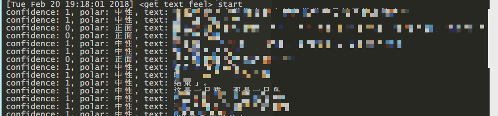

# QQSpider
```
A python crawler to grab personal dynamics (including text and pictures) from QQ zone

一个python爬虫，用来抓取QQ空间的说说和图片，并提供了相应的分析接口
```

## Dependency
```
1. python(>3.0)
2. json, hashlib, time, random, re, string (come with)
3. urllib, requests
4. selenium, geckodriver, firefox(>56.0) or Chrome(>?)
5. jieba, scipy, matplotlib, wordcloud, PIL
```

## Usage

1. config.json
    > username & password: QQ账号和密码

    > auto: True时将自动获取cookies(提供用户名和密码), False时手动填写cookies

    > app_id & app_key: 腾讯AI接口

2. API
    > qqspider.init(): 爬虫的初始参数设置，包括cookies在内

    > qqspider.get_friends_list(): 获取所有好友列表
    
    > qqspider.get_given_friends_contents(class \<list>): 爬取指定好友(所有信息)

    > qqspider.get_all_friends_contents(class \<list>): 爬取所有好友(所有信息)

    > qqspider.get_shuoshuo(class \<list>): 爬取指定好友的说说

    > qqspider.get_photos(class \<list>): 爬取指定好友的个人图片

    > qqspider.get_text_feel(class \<string>): 对指定好友的说说进行情感分析

    > qqspider.get_word_cloud(class \<string>): 生成指定好友说说的词云 

3. Others
    > cookies的获取基于selenium提供的自动化headless firefox, 建议手动输入

    > 情感分析基于一定的正则规则进行了初步的过滤，但是仍然会有一些非法字符出现

    > 词云的stopwords采取了stopwords.txt中的内容


## ScreenShots
- 
- 
- 
- 
- 
- 


